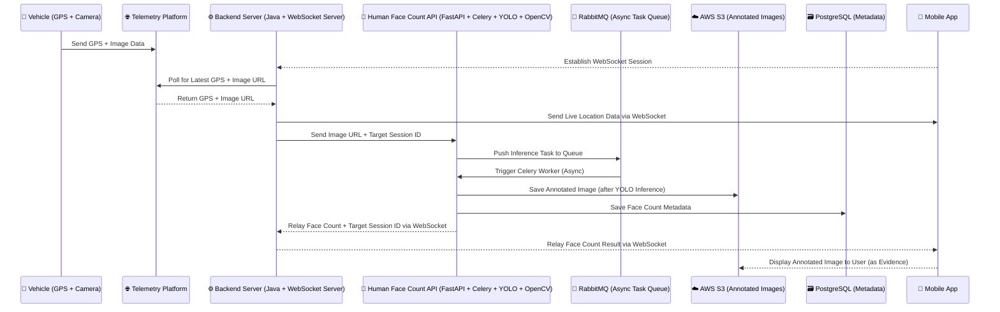

# 🚀 AI Powered Fleet Management Platform

Below is an original architecture of projects that I will be posting on this repo over time .

---

## 🧭 System Architecture Overview

This architecture enables real-time fleet monitoring, image analysis, and face detection through asynchronous AI processing.

### 📊 Architecture Sequence Diagram

---

## 🧩 Actor Descriptions

| Actor | Description |
|:------|:-------------|
| **🚗 Vehicle (A)** | Captures live GPS and image data from the field. |
| **🌐 Telemetry Platform (B)** | Legacy GPS & image gateway that stores and exposes telemetry data. |
| **⚙️ Backend Server (C)** | Java WebSocket server managing client sessions, fetching telemetry, and relaying data. |
| **🤖 Human Face Count API (D)** | FastAPI service running YOLO for face detection asynchronously with Celery. |
| **🐇 RabbitMQ (I)** | Message broker for Celery tasks enabling non-blocking inference processing. |
| **☁️ AWS S3 (G)** | Stores YOLO-annotated images. |
| **🗃️ PostgreSQL (H)** | Persists face count metadata (timestamp, image reference, session ID). |
| **📱 Mobile App (J)** | Establishes WebSocket session, receives live face count updates, and displays annotated evidence. |

---

## ⚙️ Data Flow Summary

1. **Vehicle → Telemetry Platform:** Sends GPS and image data.  
2. **Mobile App → Backend Server:** Establishes WebSocket connection.  
3. **Backend → Telemetry Platform:** Polls for new GPS + image data.  
4. **Backend → Face Count API:** Sends image URL + session ID.  
5. **Face Count API → RabbitMQ:** Queues inference task.  
6. **Celery Worker → YOLO → S3 + PostgreSQL:** Annotates image, saves results.  
7. **Face Count API → Backend → Mobile App:** Relays face count + annotated image evidence.  
7. **Mobile App→ S3:** Serves annotated images as evidence 

---

## 🧠 Tech Stack Overview

| Layer | Technology | Purpose |
|:------|:------------|:---------|
| **AI Inference** | YOLO (Ultralytics) | Detect human faces in images. |
| **Web Framework** | FastAPI | Serve inference API. |
| **Task Queue** | Celery + RabbitMQ | Async task handling for image processing. |
| **Database** | PostgreSQL | Store face count metadata. |
| **Storage** | AWS S3 | Save annotated images. |
| **WebSocket Server** | Java | Handle client sessions and stream updates. |
| **Frontend** | Flutter - Mobile App | Displays live data and annotated images. |
| **Language** | Python | Main application logic and inference. |

---

## 📜 License
MIT © 2025 — Daniel Moshi
